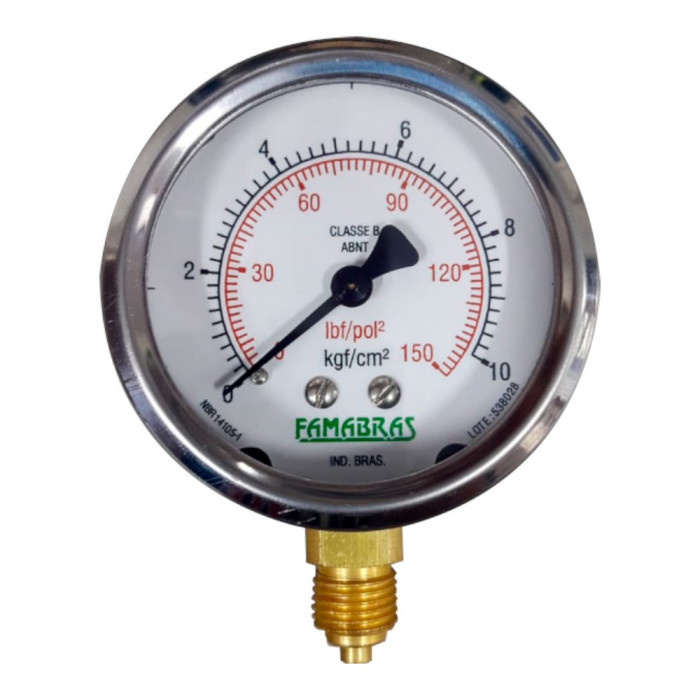
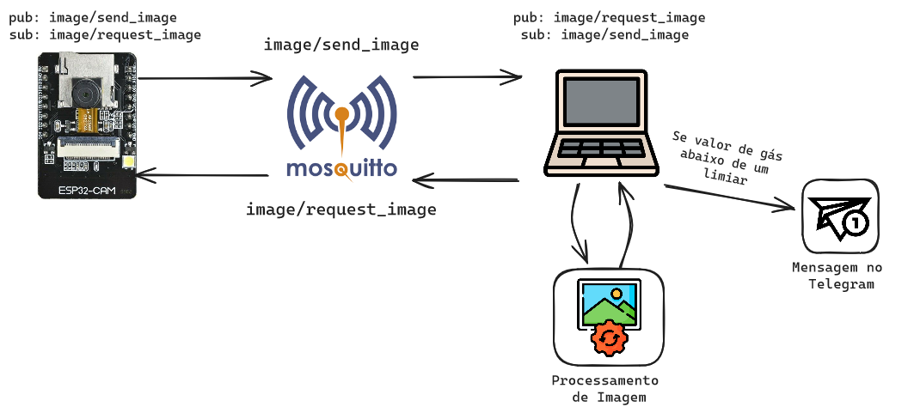
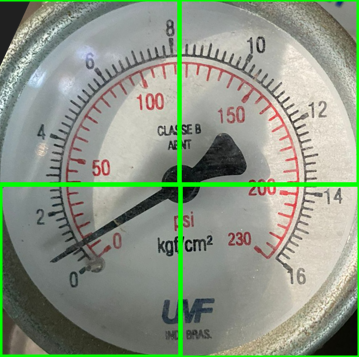

# Trabalho final da disciplina de OTRS 

Repositório contendo o trabalho final de OTRS (TÓPICOS ESPECIAIS EM REDES DE
COMPUTADORES E SISTEMAS DISTRIBUÍDOS), contendo uma aplicação IoT (Internet of Things) para realizar o monitoramento do nível de cilindros de gás através das informações de pressão de um manômetro analógico acoplado ao sistema, de maneira não invasiva. O objetivo desse monitoramento é conseguir reconhecer de maneira preventiva se o nível do cilindro está abaixo de um limiar pré-estabelecido. Segue abaixo o exemplo de um manômetro:



A solução desenvolvida se baseia na utilização de um ESP 32 CAM que possui uma câmera acoplada, juntamente de algoritmos de processamento de imagens para realizar a captura das imagens do manômetro e processá-las com intuito de obter a informação do nível atual do cilindro de gás. Caso a imagem indique que o ponteiro está abaixo do limiar estabelecido é enviada uma mensagem via Telegram para o responsável desse cilindro avisando que está na hora de realizar a sua troca.

## Tecnologias utilizadas:

As seguintes tecnologias foram utilizadas para desenvolver o sistema:

+ **Notebook:** o notebook atua com dois papeis distintos nesse trabalho, sendo estes:
ser o servidor broker MQTT local da rede, gerenciando a mensagem que estão
sendo trocadas; cliente MQTT que recebe as imagens enviadas pelo ESP32-CAM
e realiza o processamento desta imagem e envia uma mensagem para quem o
gerencia os cilindros caso o ponteiro esteja abaixo do limiar.

+ **ESP32-CAM:**  microcontrolador desenvolvido sobre uma arquitetura 32 bits possuindo uma câmera OV2640 de 2 megapixels já acoplada ao seu hardware. Possuindo suporte nativo aos protocolos da camada de enlace WiFi (802.11) e Blue-
tooth. Sendo o hardware principal do trabalho, do qual propicia a obtenção e os
envios das imagens do manômetro.

+ **MQTT:** o MQTT é um protocolo da camada de aplicação leve desenvolvido
para a troca de mensagens entre dispositivos IoT. O protocolo fornece um
método leve para envio das mensagens a partir do seu modelo publish/subscribe.

+ **Mosquitto:** o Mosquitto é um broker (servidor) de mensagens MQTT open
source desenvolvido pela Eclipse Foundation. A principal vantagem que justifica a escolha deste broker para o trabalho é devido ao fato de ser leve e eficiente,
sendo adequado para o uso em dispositivos IoT do qual possuem recursos limitados. O uso desta tecnologia permitiu com que o ESP32-CAM enviasse as imagens
para o computador.

+ **Telegram API:**  a API (Application Programming Interface) do Telegram permite
desenvolver programas que sejam capazes de utilizar a interface de mensagens
do seu sistema. Esta API foi utilizada por meio da linguagem de programação
Python, utilizando a biblioteca python-telegram-bot possibilitando poder avisar
quem gerencia o cilindro de gás por meio de uma mensagem quando este esta
acabando.

+ **PubSubClient:** o PubSubClient é uma biblioteca que oferece um cliente MQTT
para microcontroladores, foi projetada para ser utilizada em dispositivos como
Arduino e ESP8266/ESP32. Permite que o ESP32-CAM se conecte ao broker
MQTT e faça a troca de mensagens.

+ **Paho:** o Paho é uma biblioteca desenvolvida Eclipse Foundation em Python que
oferece cliente MQTT. Está biblioteca é utilizada pelo nó MQTT (notebbok) que
realiza o processamento das imagens recebidas.

+ **IEEE 802.11:** é um conjunto de especificações para redes locais sem fio (WLAN),
definindo os protocolos e técnicas utilizadas para a comunicação sem fio entre
os dispositivos. Está tecnologia foi utilizada como protocolo da camada física e
de enlace para realizar troca de mensagens entre o ESP32-CAM e o notebook.

+ **Visual Studio e PlataformIO:** o Visual Studio é um ambiente de desenvolvimento integrado (IDE) que permite criar, editar e depurar código, já a PlataformIO é uma extensão para o Visual Studio que permite desenvolver código para plataformas embarcadas de diferentes arquiteturas.

## Arquitetura do Sistema:

O sistema é composto de dois subsistemas, sendo separados pelas seguintes pastas: 

+ **esp32cam:** nessa pasta se encontram os arquivos do programa para ESP 32 que faz a captura das imagens e envia para serem processadas em outro computador.
    
+ **server:** nesse pasta se encontram os arquivos do sistema de processamento de imagens que roda em computador convencional (pc). Também se encontra um sistema para realizar o *publish* e o *subscrib* de tópico no *broker* MQTT.

A imagem abaixo apresenta o diagrama da arquitetura proposta: 



O broker MQTT é o elemento central nesta arquitetura, provendo o meio para a troca de mensagens entre o ESP32-CAM e o notebook. Tanto o ESP32-CAM como notebook atuam como publish e subscriber na rede, trocando mensagens pelos tópicos: image/request_image onde o notebook atua como publisher e o ESP32-CAM como subscriber, fazendo uma requisição de uma imagem para o ESP32-CAM; já o tópico image/send_image funciona de maneira contrária, com o ESP32-CAM atuando como publisher enviando a imagem para o notebook que atua como subscriber

O diagrama também apresenta como ocorre a sequência de processos nestes sis-
tema, começando com o notebook enviando uma mensagem requisitando uma imagem
para o ESP32-CAM, após o ESP obter a imagem está é enviada para o notebook onde é
salva e utilizada no algoritmo de processamento de imagem.
Caso está imagem esteja abaixo do limiar pré-estabelecido, uma mensagem é enviada para
o bot Notificador de Gás do Telegram notificando os gestores que o gás está acabando como demonstra a imagem a abaixo:


ara começar a receber notificações basta utilizar o comando **\notificar**, e para parar de receber notificações utilize o comando **\remover**.

## Algoritmo de processamento de imagem

O algoritmo implementado para realizar o processamento da imagem obtida do
manômetro foi inspirado pelo método proposto por [Francisco 2022], no qual foram utilizadas técnicas de processamento de imagens de modo a obter o ângulo (em graus) de
inclinação do ponteiro do manômetro. As etapas do processamento das imagens obtidas
do manômetro aplicadas foram as seguintes:

+ **Seleção da região de interesse:** Usando a Transformada de Hough, foi possível
detectar o círculo inferior na imagem - essencial para remover dados indesejados
que possam atrapalhar o processamento;

+ **Detecção de bordas e binarização da imagem:** A imagem foi tratada de modo
que o ponteiro do manômetro, que é a principal fonte da informação a ser extraída,
tivesse o canal com máximo contraste com relação a quaisquer outros elementos
da imagem;

+ **Computação do pertencimento do ponteiro à subdivisão da imagem:** Em vez
de usar técnicas complexas de cálculo do ângulo como em [Francisco 2022](https://www.sba.org.br/open_journal_systems/index.php/cba/article/view/3572), para
o caso de uso específico do alerta no caso de o nível do gás estar baixo, usar uma
técnica mais simples de modo a apenas obter a informação de se o ponteiro está
ou não abaixo de um limiar pré-estabelecido de taxa de pertencimento (medido
em porcentagem) a uma das subdivisões da imagem.

Mais especificamente, as subdivisões determinadas no processamento da imagem
são quatro quadrantes: Superior esquerdo, superior direito, inferior esquerdo e inferior direito. Para determinar se o nível do gás no cilindro está baixo ou não, foi suficiente
estabelecer uma correlação entre taxa de pertencimento do ponteiro a um quadrante.



## Instalação do sistema

Primeiramente baixe o repositório:

```
git clone https://github.com/andreFelipeHFuck/OTRS.git
```

### Configurando esp32cam

Baixe a extensão do PlataformIO para o Visual Studio, após isso clique no símbolo da extensão em Pick a Folder e escolha o diretório do esp32cam.

Conecte o ESP32 a uma porta USB do seu computador e clique no canto inferior direito em PlatformIO:Upload para passar o código do computador para a placa.

### Configurando Server:

No terminal navegue até  a pasta server do projeto e crie um ambiente virtual python com os seguintes comandos:

```
cd server 

python -m venv ./

```

Ative o ambiente virtual:

```
source ./bin/activate
```

Instale as dependências do projeto:

```
pip install -r requirements.txt
```

Para iniciar o sistema é preciso rodar dois programas diferentes, o mqtt_image_sub.py que salva e processa as imagens recebidas pelo ESP e envia mensagens para o bot do Telegram. E o mqtt_pub.py que faz a solicitação de imagens para o ESP.

```
# iniciando o mqtt_image_sub.py
python3 mqtt_image_sub.py

# iniciando o mqtt_pub.py
python3 mqqt_pub.py
```
